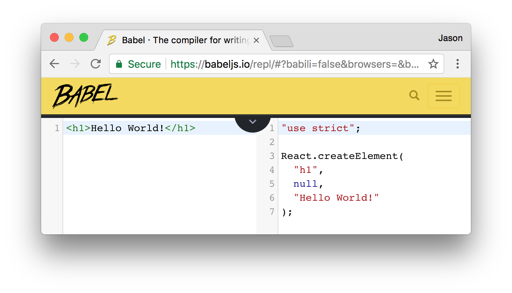
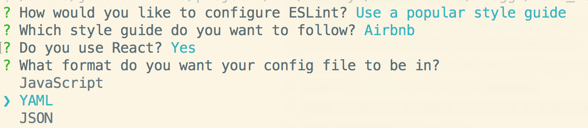

##  Intro to React.js

---


---

Welcome! This lesson assumes you have some JavaScript knowledge and awareness of the DOM tree. Beyond that, we'll be here to teach you!

### What is ReactJS?

First, let's think about where you might see a React.js app. Here are two quick and easy examples:

*   Facebook

    *   Facebook actually built React! It needed web pages that could change quickly based on a user's interaction — your Facebook feed, for example.

*   Instagram
    *   Instagram's public feed and internal system are entirely built on React.

For an intro to React, watch [this video](https://generalassembly.wistia.com/medias/lr8idjxtx8) (note: right click to open in a new tab!).

The React framework was built to solve one problem: building large applications with data that changes over time.

Before React, re-rendering one thing meant re-rendering everything.
This had negative implications on processing power and ultimately user experience, which at times became glitchy and laggy.

React is "agnostic" to other tools in your front end. This means that React can co-exist with other Javascript frameworks, letting the other frameworks handle the models and controllers and having React sort out the views.

#### Some History

For a quick rundown, React was...

*   First used by Facebook in 2011.
*   Adopted by Instagram in 2012.
*   Made open source in May 2013.

This can be extrapolated to - both Facebook and Instagram are React apps!

To get more hands on and in-depth down the React rabbit hole, let's keep going!

_If you want to get an in-depth taste of what React is all about, [here's an introduction from React.js Conf 2015](https://www.youtube.com/watch?v=KVZ-P-ZI6W4&feature=youtu.be&t=510). (note: right click to open in a new tab!). We'd recommend starting around the 8:35 mark and watching until 16:30. This link is also in the Further Reading page at the end of the React module._

#  Hello World exercise - You do!

### Preparation

*   Add [React Dev Tools](https://chrome.google.com/webstore/detail/react-developer-tools/fmkadmapgofadopljbjfkapdkoienihi) to Chrome
*   Babel syntax highlighter for your text editor
    *   Sublime: [Babel](https://packagecontrol.io/packages/Babel)
    *   Atom: [Babel](https://atom.io/packages/language-babel)

### Learning Objectives

_After this lesson, students will be able to:_

*   Build a React app using `create-react-app`
*   View `create-react-app` working locally

## Initial Setup

Let's jump right in! We'll create a skeleton React project and walk through it as we go.

An easy way to start React projects is to use a Terminal program called `create-react-app`. This excellent tool, created by Facebook, will help you set up a bare-bones React app instantly. We can simply install the package and start coding.

Let's use `npm` to install it globally so we'll always have it available in our Terminal. Run:

```sh
$ npm i -g create-react-app
```

Once it's installed, create a new directory to store the app you're about to write and `cd` to the folder. Then, use the tool to create a new React app. You'll have to give your new app a name; we're calling the example app "hello_world", since that'll be our first project.

```sh
$ create-react-app hello_world
```

The tool creates a new directory for your app, so move into it...

```sh
$ cd hello_world
```

Use `yarn start` to start a server that will serve your new React application!

```sh
$ yarn start
```

> You have now set up a Hello World app that you will continue working on during this lesson's exercises!

After running `$ yarn start`, you can view the app at `http://localhost:3000`

> Note: If you ever need to stop the server, you can hit `ctrl-c` in the terminal window.

You'll notice the web page for our app automatically refreshes every time we save a file in the directory. This is an awesome feature of `create-react-app`

You can look in the directory and see the structure that `create-react-app` provides for us. It looks like this:

```sh
├── README.md
├── package.json
├── public
│   ├── favicon.ico
│   └── index.html
└── src
    ├── App.css
    ├── App.js
    ├── App.test.js
    ├── index.css
    ├── index.js
    └── logo.svg
```

Most of the important files are in the `src` directory. Specifically, we'll be using `src/App.js` and `src/index.js`.

---

### Stop / Catch Up / Investigate

Take some time and look at what's been generated. Specifically pay attention to `src/App.js` and `src/index.js`

Make small changes to the code in `src/App.js`, `src/index.js`, and `public/index.html` just to see what happens.

Your basic React app is up and running. Now you're ready to add complexity.

#  Components and JSX

### Learning Objectives

_After this lesson, students will be able to:_

*   Identify and define React components
*   Describe why we use components in React
*   Build a React component
*   Describe what JSX is transpiled into

### Preparation

*   Have `create-react-app` installed

## Components

The basic unit you'll be working with in ReactJS is a **component**. Components are pieces of our application that we can define once and reuse all over the place.

> **Note!**
>
> For the next day or so, we'll be working with _functional components_. These are lightweight versions of the more robust class-based components we'll see later.
>
> _**Hint:**_ Functional components are functions; regular components are classes.

For an intro to components, watch [this video](https://generalassembly.wistia.com/medias/h64z7lp1ir) (note: right click to open in a new tab!).

If you're used to writing out all of a page's view in a single HTML file, using components is a very different way of approaching web development.

With components, there is more integration and less separation of HTML, CSS, and JavaScript.

*   Instead of creating a few large files, you will organize your web app into small, reusable components that encompass their own content, presentation, and behavior.

When using React, building components will be your main front-end task.

*   Because they're so encapsulated, components make it easy to reuse your code, test, and separate concerns.

### Identifying Components

Take a look at [CraigsList](https://boston.craigslist.org/search/aap) (note: right click to open in a new tab!).


Each listing is a component. How can you identify this?

*   Listings look identical in structure, but have different information populating them
*   Listings are dynamically generated based on the user's search

Now, go to [Amtrak.com](https://www.amtrak.com/home) (note: right click to open in a new tab!). We want to look at the listing page, so put in any "From" (for example, New York - Penn Station), any "To" (for example, Boston - South Station), and pick any date. Hit "Find Trains". Now look at the listing page:


Scrolling down it, identify the visual "components" the website is comprised of. We suggest drawing this out on paper! So something like this...


As you're drawing this out, think about the following questions...

*   Where do you see "nested components;" that is, where are there components inside another component? Where do you see just one "layer" instead?
*   Are there any components that share the same structure?
*   For components that share the same structure, what is different about them?

### So -

What does a component look like? Let's start with a simple "Hello World" example...

### Hello World exercise - You do!

#### Code along: A Very Basic Component

In this section, we'll walk through:

*   Removing the pre-filled contents of your `hello_world` app.
    *   `create-react-app` filled your app with sample content - let's make room for your app!
*   Adding your own component definition.
    *   You want the app to display the words "Hello World!"

-   Going through what we've done in detail!

To start, remove the entire contents of the `src/App.js` file.

Then, add the component definition below - and yes, we know there are no semicolons here. Industry standards for React are to use semicolons as little as possible!

*   With that said, many companies have their own programming style guide. While many companies don't use semicolons in React, some companies do - for example, AirBnB. It's important to check with your company for their practices!

```js
// bring in React from react

import React from "react";

// define our Hello component
function Hello() {
    // what should the component render?
    // make sure to return some UI
    return <h1>Hello World!</h1>;
}

export default Hello;
```

Let's break down the things we see here...

`import React from 'react'`

This imports React methods from the React library.

`function Hello`

This is the component we're creating. In this example, we are creating a functional component and calling it "Hello."

<!-- ##### `extends Component`

We inherit from the `Component` React library class to create our component definitions. Here, we are creating a new `Component` subclass called `Hello`.
- Because it extends (also known as inherits from) `Component`, our `Hello` class gets to reuse code and capabilities from `React.Component`. -->

`return()`

Every functional component must return _**one**_ jsx tag. This is what renders the component to the screen, (i.e., it controls what is displayed for this component). From this function, we return what we want to display.

*   In our case, we are rendering a "Hello World!" heading: `<h1>Hello World!</h1>`.

> Note!
>
> That heading tag above looks like it's straight out of HTML, but it's actually a special language called JSX, which you'll see on the next page. For now, know that JSX will act like HTML when it's rendered to the screen.

`export default Hello`

This exposes the `Hello` class to other files. This means that other files can `import` from the `App.js` file in order to use the `Hello` class. In our case, we'll be importing it into `index.js` by calling an `import` to `App.js`.

When we try to import something from `App.jsx`, JavaScript will attempt to match a named export.

*   Our only named export in `App.jsx` is `Hello`.

The `default` keyword means that if we try to import anything from this file that the app can't find, JavaScript will automatically revert to importing `Hello` instead.

*   Only one default export is allowed per file.

### Check it out!

If you switch to your browser and navigate to http://localhost:3000, you can see your "Hello World!" heading. This app dynamically reloads each time you save, so you can check your changes at any point.

### Wait - What's that HTML doing in my Javascript?

This is currently the contents of our `src/App.jsx` file (note the condensed `export` statement):

```js
// bring in React and Component from React

import React from "react";

// define our Hello component
export default function Hello() {
    // what should the component render?
    // make sure to return some UI
    return <h1>Hello World!</h1>;
}
```

### Try it (5 mins)

Let's talk about what this function returns. It looks an awful lot like an HTML heading, but it's not. We often write out React components in **JSX**.

Wait, what's that? Try it yourself:

1.  Go here: [Babeljs.io](https://babeljs.io/repl/)
2.  Click on "try it out"
3.  You should now see a split screen similar to below
4.  Paste in `<h1>Hello World!</h1>` in the left panel.
5.  You should see the resulting plain javascript on the right.
6.  Try any other HTML you might know and see what happens



So, JSX allows us to write code that strongly resembles HTML. It is eventually compiled to lightweight JavaScript objects.

> React can be written without JSX. We won't be doing this, but if you want to learn more, [check out this blog post](http://jamesknelson.com/learn-raw-react-no-jsx-flux-es6-webpack/) (note: open in new tab!).

Your `Hello` component renders:

*   Currently returns JSX, not HTML.
*   The JSX creates a heading with `'Hello World!'`.
*   Your component reads this and renders a "Hello World!" heading.

### Challenge: Greet the day!

*   Change your `Hello` component to return multiple lines.
    *   Add a line below the "Hello World!" heading that will display `"It is time for tea."` in an `h3`.

> Hint: Remember, the return statement can only return one DOM element. You can, however, place multiple elements within a parent `div` element.

##  The Virtual DOM

### Preparation

Now is a great time to initialize [`eslint`](https://eslint.org/) so we get some feedback while coding.

1.  `npm i -D eslint`
2.  `npx eslint --init` and answer the following wizard:
    
3.  replace your `.eslintrc.yml` with this

```yaml
extends: airbnb
rules:
  "react/prop-types": 0
```

### Learning Objectives

_After this lesson, students will be able to:_

*   [ ] Describe the Virtual DOM versus the standard DOM
*   [ ] Diagram how components are called, assembled and placed on the real DOM
*   [ ] Use .jsx file extentions for files containing JSX

### Before we begin!

We've been shoving JSX and JS into files named `*.js`. As good practice and to follow AirBnb's style suggestions, we should name any file containing JSX `*.jsx`

*   [AirBnb Style Guide](https://github.com/airbnb/javascript/tree/master/react#naming)

### Review and Refactor

`Hello` in `src/App.jsx` is our component class. It returns the JSX for our "Hello World!" and heading tags. Keeping components separate and organized is a best practice, so we created that in its own file.

To show up on the page, though, that component still needs to actually be called from somewhere. The main "hub" of our React app is `src/index.js`. We'll investigate how `src/index.js` is currently loading and rendering the component, and we'll improve the code by making it more explicit and readable.

Look at your `src/index.js` file, and contrast it with the code below.

```js
import React from "react";
import ReactDOM from "react-dom";
import Hello from "./App";

ReactDOM.render(<Hello />, document.getElementById("root"));
```

The first (and smallest) difference is that we've dropped the CSS file import. We just aren't using it.

The next difference is that `import App from './App';` has turned into `import Hello from './App'`.

> This line imports the `Hello` component from the `src/App.js` file. Remember, the `default` part of `export default Hello` in `src/App.js` means that importing other names - like `App` - actually _already_ brings in the `Hello` component! As a best practice, though, we're going to explicitly import the `Hello` component.

The last difference is that `ReactDOM.render( <App />,` has turned into `ReactDOM.render( <Hello />,`.

> This changes the `ReactDOM.render()` call to explicitly say "Render whatever the component `Hello` returns."

### Hello World exercise - You do!

### Code along: Calling our `Hello` component explicitly

Update your `index.js` file to have the three changes listed above:

*   Delete the CSS import.
*   Change the component name that's imported to be your `Hello` component.
*   Change the component name that's used inside `ReactDOM.render` to be your `Hello` component.

> Check it out! You should be able to browse to http://localhost:3000 and see that nothing has changed.

## Virtual DOM Intro

You should be familiar with the DOM. You may have noticed that our `src/index.js` code mentions `ReactDOM`. `ReactDOM` doesn't refer to the same DOM we know. Instead, it refers to a **Virtual DOM**. The Virtual DOM is a key piece of how React works.

So, how is this different? Watch [this video](https://generalassembly.wistia.com/medias/v5qyqsir0s) to find out. _(note: right click for new tab!)_

In React, the virtual DOM is a staging area for changes that will eventually be implemented.


> If you're interested in learning more about the Virtual DOM, [check this video out](https://www.youtube.com/watch?v=-DX3vJiqxm4). _(note: right click for new tab!)_

You know every component eventually produces **JSX**. The `ReactDOM.render()` method generates a Virtual DOM node to be added to the actual DOM, _mounting_ it to an element already in the DOM.

The `ReactDOM.render()` function takes two arguments:

```js
ReactDOM.render(<Hello />, document.getElementById("root"));
```

*   `<Hello />` uses **the name of the component to render**. In our `App.js` file, the `Hello` component returns the content to render: a div with "Hello World!" and heading tags (written in JSX). As a reminder, this is the `Hello` component:

```js
export default function Hello() {
    // make sure to return some UI
    return (
        <div>
            <h1>Hello World!</h1>
            <h3>It is time for tea.</h3>
        </div>
    );
}
```

*   The second argument of the `ReactDOM.render()` function is `document.getElementById('root')`; this finds **the DOM element to which your React application will be mounted**. This argument can be any element on the page. Here, we're simply appending it to an element with the id `root`. (Look through the `index.html` file if you're curious about the HTML structure from `create-react-app`.)

When our `index.js` is processed, React compares the virtual DOM to the regular DOM and only updates the `root` element on the page.

> Side note: What is `<Hello />` written in? JSX! Whenever you use a
> self-closing tag in JSX, you **MUST** end it with a `/`, like `<Hello />` in the
> above example. If you don't use a self-closing tag, JSX will look for a closing tag and never find it!

##  Props

### Learning Objectives

_After this lesson, students will be able to:_

*   [ ] Describe the role props plays in our applications
*   [ ] Create a component that renders props

### Component Data with Props

The React framework was built to handle data that changes over time.

So far, we have defined a `Hello` component in `App.jsx`. The component returns a `div` with a few headings, written in JSX.

In `index.js`, we are importing this component, appending what the `Hello` component's `render` method returns to the virtual DOM, and rendering that.

This is great, but it doesn't involve any data yet, let alone data that changes over time!

Let's make it more interesting.

Rather than simply displaying "Hello world", let's display a greeting to the user. We'll make the greeting change dynamically based on the user's name.

The question is, how do we add a name to our `Hello` component without hardcoding it?

Find out! Try it yourself alongside [this video](https://generalassembly.wistia.com/medias/gchiu63slo) in [this codepen](https://codepen.io/susir/pen/vxWypq) _(note: right click both for new tab!)_

### Hello World exercise - You do!

### Code along: Adding props to our component

Let's use **props** to make our "Hello World" app more flexible.

##### First, a single prop

We want to make a greeting that's reusable for many different users, so we'll have a `name` prop for the name of the user.

In your `src/index.js`, we'll change the line that renders the `Hello` component to include this `name` prop. The new line will be:

`<Hello name={"Nick"} />`

> We pass in data wherever we are rendering our component. In rendering the `Hello` component above, we pass in a prop called "name" with a value of "Nick".

Your `index.js` should now look like this:

```js
import React from "react";
import ReactDOM from "react-dom";
import Hello from "./App.js";

ReactDOM.render(<Hello name={"Nick"} />, document.getElementById("root"));
```

Now, every time we render our component, we will pass in data.

*   When the `Hello` component renders, we pass the `Hello` component a prop called `name` with a value of `Nick`.

If you check your application now, nothing has changed. We're passing the `name` prop into the component, but the component isn't _using_ it yet.

In our component definition, we will make a few changes:

1.  Change the function signature to include a named parameter: `function Hello(props) {}`.
2.  Change the `<h1>Hello World!</h1>` to `<h1>Hello {props.name}!</h1>`. The portion `{props.name}` deserves a closer look:

*   `props` will collect all the props for this component instance
*   `props.name` pulls out the name property from `this.props`.

> The `{}` syntax in JSX renders the result of any expression inside it. It works even without props. If you wrote `{2+2}` in your JSX, `4` would be rendered.

In `App.jsx`, your `Hello` class should now look like this:

```js
import 'React' from react;

export default function Hello(props) {
  return (
    <div>
      <h1>Hello {props.name}!</h1>
      <h3>It is time for tea.</h3>
    </div>
  );
};
```

In the above example, we replaced "world" with `{props.name}`.

> Check it out! You should be able to browse to http://localhost:3000 to view this change!

##  Multiple Props

### Learning Objectives

_After this lesson, students will be able to:_

*   [ ] Pass multiple individual props to a component
*   [ ] Pass multiple props as an object to a component

### What about... multiple props?

Of course, we often want components to display more complex information. To do so, we can pass multiple properties to our component! We'll use the same two steps we took to add the first prop.

First, add another prop to the component call: `<Hello name={"Nick"} />,` changes to `<Hello name={"Nick"} age={24} />`.

Update your `index.js` file to reflect this:

```js
import React from "react";
import ReactDOM from "react-dom";
import Hello from "./App";

ReactDOM.render(
    <Hello name={"Nick"} age={24} />,
    document.getElementById("root")
);
```

Now, in our component definition we have access to both values. The second step is to change the `Hello` component class in `App.jsx` to use the age information!

```js
export default function Hello(props) {
    return (
        <div>
            <h1>Hello {props.name}!</h1>
            <p>You are {props.age} years old.</p>
        </div>
    );
}
```

> Check it out! You should be able to browse to http://localhost:3000 to view this change!

### What about... multiple props passed from an object?

If we have many props, it might get difficult to keep track when we're passing everything in to render a component. A better practice is to organize values in some kind of object and then pass props to the component from that object. Let's see this strategy.

Currently, in `index.js`, we put Nick's name and age directly into the `ReactDOM.render` call. Instead, we'll create an object that holds Nick's name and age, making it clearer for other developers and easier to change in the future. In your `index.js file`, below the `import` statements, add this object definition:

```js
var person = {
    personName: "Nick",
    personAge: 24
};
```

Next, we'll update what's passed into the component. Near the bottom of your `index.js`, modify the `ReactDOM.render()` call:

```js
ReactDOM.render(
    <Hello name={person.personName} age={person.personAge} />,
    document.getElementById("root")
);
```

We don't have to change anything in `App.jsx`, because it's still receiving exactly the same values for exactly the same two props - `name` and `age`. We're just sending it those values in a slightly different way.

> Check it out! If you browse to http://localhost:3000 nothing should have changed.

> Try changing the values inside the `person` object without changing the `ReactDOM.render()` call. See how the page updates.

#### Multiple props from a more complex object

Since we're just pulling props out of an object, we can use any object we want. For example, we can nest an array inside it.

Let's say our user has some favorite animals. Update your object to include an array:

```js
const person = {
    personName: "Nick",
    personAge: 24,
    favorites: ["capybaras", "Tigers", "Dinosaurs count!"]
};
```

Now we can use this new information as a prop, just like normal. You could choose to pass a single element (`favorites[0]`) or the entire array. We'll use the entire array so that the component can display _all_ a person's favorite animals. First, update your `ReactDOM.render()` call in `index.js`:

```js
ReactDOM.render(
    <Hello
        name={person.personName}
        age={person.personAge}
        animals={person.favorites}
    />,
    document.getElementById("root")
);
```

If you check your application now, nothing has changed. Remember, a component class will just ignore any props it receives that it doesn't use. But, we want to use the favorite animals! So, second, update your `Hello` class `render` method in `App.jsx`:

```html
<div>
  <h1>Hello {props.name}!</h1>
  <p>You are {props.age} years old.</p>
  <p>You love: {props.animals}</p>
</div>
```

If you check the page now, you'll see React prints the entire array, as that's what was passed in. If we wanted to include all the animals clearly, we could fix the spacing. Instead, to review some syntax, let's just modify the code to render the first value.

```html
<div>
  <h1>Hello {props.name}!</h1>
  <p>You are {props.age} years old.</p>
  <p>You love: {props.animals[0]}</p>
</div>
```

Check it out!

_[Read more about using props in JSX, if you'd like!](https://facebook.github.io/react/docs/jsx-in-depth.html) This link is also in the Further Reading page at the end of the React module, under the Facebook documentation._
