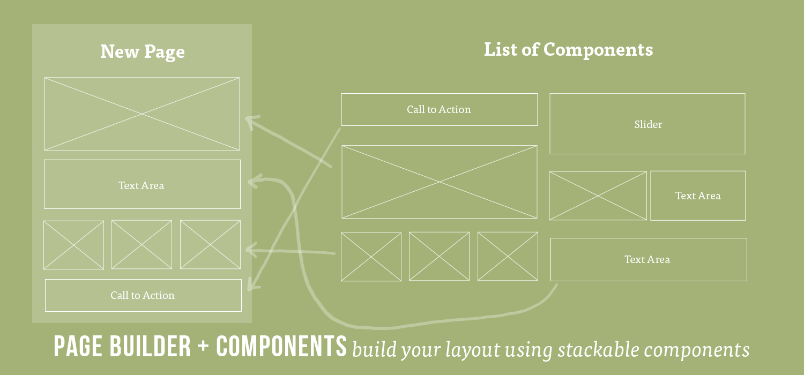
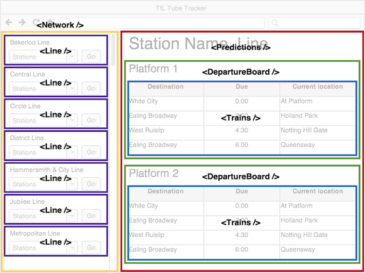
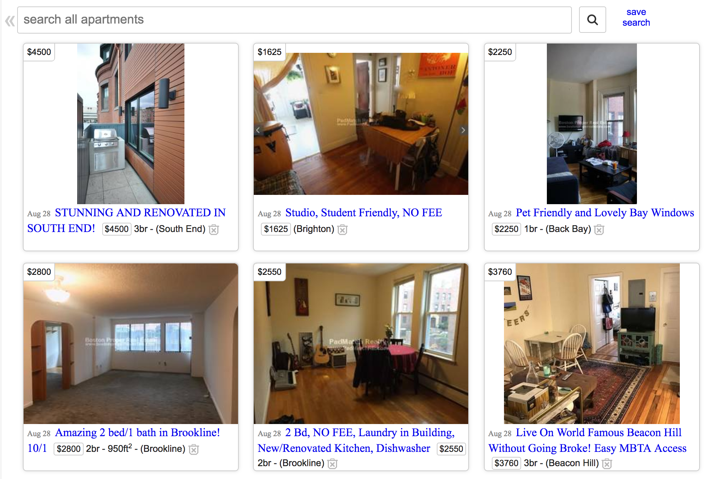

##  Intro to React.js


## Learning Objectives

* Explain what a frontend framework is and why they can be helpful in writing more complex applications.
* Explain what ReactJS is and where it fits in our applications' stack.
* Explain the component model of web development.
* Create and render React components in the browser.

## Framing

### What is a Frontend Framework?

- A framework is software providing generic functionality and structure that serves as foundation to build and deploy applications.
- Frameworks can help standardize code, give you additional functionality and performance, and can help get your code off the ground faster.  
- There are [many](https://stateofjs.com/2017/front-end/) front end frameworks and each goes about solving problems of how state is managed, updated, and represented by a view but there are many commonalities.
- There is a lot of debate over whether frontend frameworks count as frameworks at all -- some people say that they are just libraries and should be referred to as such.

### What is ReactJS?

First, let's think about where you might see a React.js app. Here are two quick and easy examples:

*   Facebook

    *   Facebook actually built React! It needed web pages that could change quickly based on a user's interaction — your Facebook feed, for example.

*   Instagram
    *   Instagram's public feed and internal system are entirely built on React.

For an intro to React, watch [this video](https://generalassembly.wistia.com/medias/lr8idjxtx8).

React is a JavaScript framework used to craft modern day UI and views for the front-end in web applications.

> **Selling Point:** By modeling small compatible components that focus on just rendering a view, we can move business logic out of the DOM, and therefore improve our app's performance, maintainability, modularity and readability.

React is "agnostic" to other tools in your front end. This means that React can 
co-exist with other Javascript frameworks, letting the other frameworks handle 
the models and controllers while having React handle the views.

### Some History

The first thing most people hear about React is "Facebook uses it."

*   First used by Facebook in 2011.
*   Adopted by Instagram in 2012.
*   Made open source in May 2013.

React was born out of Facebook's frustration with the traditional MVC model and:

  * how re-rendering something meant re-rendering **everything** (or just a lot).
  * how it had negative implications on processing power and ultimately user experience, which at times became glitchy and laggy.

_If you want to get an in-depth taste of what React is all about, [here's an introduction from React.js Conf 2015](https://www.youtube.com/watch?v=KVZ-P-ZI6W4&feature=youtu.be&t=510). We'd recommend starting around the 8:35 mark and watching until 16:30._


### React in MVC

React can be thought of as the "Views" layer.

React will work with any back-end language, but for project 3 and in our in-class examples we will be using Mongoose and Express for the models and controllers.

<details>
  <summary>What is the role of a <strong>view</strong> in a front-end Javascript application? Click arrow for answer:</summary>
  The visual template the user sees, often populated with data from our models.
</details>

## Components and JSX

#### Learning Objectives

_After this lesson, students will be able to:_

*   Identify and define React components
*   Describe why we use components in React
*   Build a React component
*   Describe what JSX is transpiled into

#### Preparation

*   Have `create-react-app` installed

## Components

The basic unit you'll be working with in ReactJS is a **component**. Components are pieces of our application that we can define once and reuse throughout.

For an intro to components, watch [this video](https://generalassembly.wistia.com/medias/h64z7lp1ir) (Note: right click to open in a new tab).

If you're used to writing out all of a page's view in a single HTML file, using components is a very different way of approaching web development.



> Source: [WanderOak - Fixed Templates vs. Components](https://wanderoak.co/fixed-templates-vs-components/)

With components, there is more integration and less separation of code based purely on file type (HTML, CSS, and JavaScript), and more towards a **component-based** separation of concerns.

*   Instead of creating a few large files, you will organize your web app into small, reusable components that encompass their own content, presentation, and behavior.

When using React, building components will be your main front-end task.

*   Because they're so encapsulated, components make it easy to reuse your code, test, and separate concerns.



> [MakeTea - Building Robust Apps with React](http://maketea.co.uk/2014/03/05/building-robust-web-apps-with-react-part-1.html)

Notice the structure of how the various components are nested:
	
```
- TubeTracker
    - Network
        - Line
    - Predictions
        - DepartureBoard
            - Trains
```

- `TubeTracker` contains the application
- `Network` displays each line on the network
- `Line` displays the stations on a line
- `Predictions` controls the state of the departure board
- `DepartureBoard` displays the current station and platforms
- `Trains` displays the trains due to arrive at a platform

### We Do: Identifying Components

Take a look at [CraigsList](https://boston.craigslist.org/search/aap) (Note: right click to open in a new tab).



<details>
  <summary>Each listing is a component. How can you identify this?</summary>

*   Listings look identical in structure, but have different information populating them
*   Listings are dynamically generated based on the user's search
</details>

---

### [F.I.R.S.T. Components](https://addyosmani.com/first/)

A React component is built to expect an input and render a UI with it. More importantly, a well-structured component only receives data specific to its purpose.

This is because React follows a more **functional** approach to programming. For React components under this approach, **the same input will always produce the same output**.

Best practice is that React components follow the **F.I.R.S.T.** guidelines

#### Focused

Components should do one thing and do it well.

#### Independent

Components should increase cohesion and reduce coupling. Behavior in one component should not impact the behavior of another. In other words, components should not rely on one another.

> But they should compliment one another.

#### Reusable

Components should be written in a way that reduces the duplication of code.

#### Small

Ideally, components should be short and condensed.

#### Testable

Because the same input will always produce the same output, components are easily unit testable.

### You Do: Identifying Components 

> 10 minutes exercise. 5 minutes review.

* Break into groups of three
* Each group will look at one of the following websites: AirBnB, BBC, Bleacher Report, Flipboard, Imgur, Instagram, Khan Academy, Netflix, Postmates, and Reddit
* Identify the visual "components" the website is comprised of. Use markers to draw these out on the wall or your desk.

As you're drawing this out, think about the following questions:

* Where do you see `nested components`? Where do you not?
* Are there any components that share the same structure?
* Of these similar components, what is different about them?

---

## Initial Setup

In order to create a new project and to get our development environment setup, we are going to use the Terminal command [`create-react-app`](https://github.com/facebook/create-react-app). `create-react-app` is an NPM package built by Facebook that writes our build dependencies for us so that we can do less configuration. 

First, let's use `npm` to install `create-react-app` globally so we'll always have it available in our Terminal:

```bash
npm install -g create-react-app
```

Once it's installed, create a new directory to store the app you're about to write and `cd` into the folder. Then, use the tool to create a new React app. 
You'll have to give your new app a name; we're calling the example app `hello_world`, since that'll be our first project.

```sh
npm init react-app hello_world
```

The tool creates a new directory called `hello_world` inside the current folder. Once the installation is done, you can open your project folder:

```sh
cd hello_world
```

Use `npm start` to start a server that will serve your new React application:

```bash
npm run start
```

After running `$ npm run start`, we can view the app at `http://localhost:3000`

> You have now set up a Hello World app that you will continue working on during this lesson's exercises!

> Note: If you ever need to stop the server, you can hit `ctrl-c` in the terminal window.

You'll notice the web page automatically refreshes every time we save a file in the directory. This is an awesome feature called live reloading that `create-react-app` comes with.

You can look in the directory and see the initial project structure that `create-react-app` provides for us and all its dependencies:

```sh
hello_world
├── README.md
├── package.json
├── public
│   ├── favicon.ico
│   └── index.html
└── src
    ├── App.css
    ├── App.js
    ├── App.test.js
    ├── index.css
    ├── index.js
    └── logo.svg
```

Most of the important files, which are primarily the ones where we will be working today, are in the `src` directory.

---

### Stop / Catch Up / Investigate

Take some time and look at what's been generated. Specifically pay attention to `src/App.js` and `src/index.js`

Make small changes to the code in `src/App.js`, `src/index.js`, and `public/index.html` just to see what happens.

Your basic React app is up and running. Now you're ready to add complexity.

### We Do: Hello World - A Very Basic Component

To start, in our `/src/App.js` file, let's remove the contents and in its place add this component definition.


```js
// bring in React from react
import React from 'react'

// define our Hello component
const Hello = () => {

    // Make sure to return some UI
    return (
      <h1>Hello World!</h1>
    );
}

export default Hello
```

Let's break down the things we see here:

`import React from 'react'`

This imports React methods from the React library.

`const Hello = () => {}`

This is the component we're creating. In this example, we are creating a functional component and calling it "Hello."

`return()`

Every functional component must return _**one**_ jsx tag. This is what renders the component to the screen, (i.e., it controls what is displayed for this component). From this function, we return what we want to display.

- In our case, we are rendering a "Hello World!" heading: `<h1>Hello World!</h1>`.

> Note!
>
> That heading tag above looks like it's straight out of HTML, but it's actually a special language called JSX, which you'll see on the next page. For now, know that JSX will act like HTML when it's rendered to the screen.

`export default Hello`

This exposes the `Hello` component to other files. This means that other files can `import` from the `App.js` file in order to use the `Hello` component. In our case, we'll be importing it into `index.js` by calling an `import` to `App.js`.

When we try to import something from `App.js`, JavaScript will attempt to match a named export.

*   Our only named export in `App.js` is `Hello`.

The `default` keyword means that if we try to import anything from this file that the app can't find, JavaScript will automatically revert to importing `Hello` instead.

*   Only one default export is allowed per file.

### Check it out!

If you switch to your browser and navigate to [`http://localhost:3000`](http://localhost:3000), you can see your "Hello World" heading. This app dynamically reloads each time you save, so you can check your changes at any point.


## JSX

> Hey you got your html in my javascript!
>
> You got your javascript in my html!
>
> (https://youtu.be/O7oD_oX-Gio?t=5s)

Let's talk about the value that the render method returns. It looks an awful lot like an HTML heading, but it's not. We often write out React components in JSX.

JSX is [a language that compiles to Javascipt](http://blog.yld.io/2015/06/10/getting-started-with-react-and-node-js/#.V8eDk5MrJPN) that allows us to write code that strongly resembles HTML. It is eventually compiled to lightweight JavaScript objects.

Your Hello component's render method:

* Currently returns JSX, not HTML.
The JSX creates a heading with 'Hello World!'.
* Your component reads this and renders a "Hello World!" heading.

> React can be written without JSX. If you want to learn more, [check out this blog post](http://jamesknelson.com/learn-raw-react-no-jsx-flux-es6-webpack/).  


## The Virtual DOM

### Learning Objectives

_After this lesson, students will be able to:_

*   [ ] Describe the Virtual DOM versus the standard DOM
*   [ ] Diagram how components are called, assembled and placed on the real DOM
*   [ ] Use .jsx file extentions for files containing JSX

## Virtual DOM Intro

You may have noticed that our src/index.js code mentions ReactDOM. ReactDOM doesn't refer to the same DOM we know. Instead, it refers to a Virtual DOM. The Virtual DOM is a key piece of how React works.

So, how is this different? Watch [this video](https://generalassembly.wistia.com/medias/v5qyqsir0s) to find out.

The Virtual DOM is a Javascript representation of the actual DOM. The virtual DOM is a staging area for changes that will eventually be implemented.

- Because of that, React can keep track of changes in the actual DOM by comparing different instances of the Virtual DOM.
- React then isolates the changes between old and new instances of the Virtual DOM and then only updates the actual DOM with the necessary changes.
- By only making the "necessary changes," as opposed to re-rendering an entire view altogether, we save up on processing power.
- This is not unlike Git, with which you compare the difference -- or diff -- between two commits.

The JSX

```js
<h1>Hello World!</h1>
```

translates into

```js
React.createElement('h1', {}, 'Hello World!');
```

and React's virtual DOM representation of this is

```js
{
  type: 'h1',
  props: {
    children: 'Hello World!'
  }
}
```

Since React keeps this representation of what is on the page, it can be very
smart when it updates the page only to change the DOM that needs to be changed.
More on this later.

##  Props

### Learning Objectives

_After this lesson, students will be able to:_

*   [ ] Describe the role props plays in our applications
*   [ ] Create a component that renders props

### Component Data with Props

The React framework was built to handle data that changes over time.

So far, we have defined a `Event` component. The component returns a `div` with a few elements, written in JSX.

In `App.js`, we are importing this component.

This is great, but it doesn't involve any data yet, let alone data that changes over time!

Let's make it more interesting.

Rather than displaying the hardcoded data, let's change the event data dynamically.

The question is, how do we add a name to our `Event` component without hardcoding it?

Find out! Try it yourself alongside [this video](https://generalassembly.wistia.com/medias/gchiu63slo) in [this codepen](https://codepen.io/susir/pen/vxWypq) _(note: right click both for new tab!)_

### Hello World exercise - You do!

### Code along: Adding props to our component

Let's use **props** to make our "Hello World" app more flexible.

##### First, a single prop

We want to make a greeting that's reusable for many different users, so we'll have a `name` prop for the name of the user.

In your `src/App.js`, we'll change the line that renders the `Event` component to include this `title` prop. The new line will be:

`<Event title="Eric's Birthday Party" />`

> We pass in data wherever we are rendering our component. In rendering the `Event` component above, we pass in a prop called "title" with a value of "Eric's Birthday Party".

Now, every time we render our component, we will pass in data.

If you check your application now, nothing has changed. We're passing the `title` prop into the component, but the component isn't _using_ it yet.

In our component definition, we can use the `this.props.title` variable to access the value passed into the component.

```js
// bring in React from react
import React, { Component } from "react";

// define our Hello component
class Event extends Component {
  render() {
    // what should the component render?
    // make sure to return some UI
    return (
      <div>
        <h2>{this.props.title}</h2>
        <p>7:45 - 9 pm</p>
      </div>
    );
  }
}

export default Event;
```

> The `{}` syntax in JSX renders the result of any JavaScript expression inside it. It works even without props. If you wrote `{2+2}` in your JSX, `4` would be rendered.

> Check it out! You should be able to browse to http://localhost:3000 to view this change!

##  Multiple Props

### Learning Objectives

_After this lesson, students will be able to:_

*   [ ] Pass multiple individual props to a component
*   [ ] Pass multiple props as an object to a component

### What about... multiple props?

Of course, we often want components to display more complex information. To do so, we can pass multiple properties to our component! We'll use the same two steps we took to add the first prop.

First, add another prop to the component call: `<Event title="Eric's Birthday Party" />,` changes to `<Hello name="Eric's Birthday Party" time="7:45 - 9pm" />`.

Now, in our component definition we have access to both values. Try updating the component using `this.props.time` in the place we hardcoded the value previously.

> Check it out! You should be able to browse to http://localhost:3000 to view this change!

_[Read more about using props in JSX, if you'd like!](https://facebook.github.io/react/docs/jsx-in-depth.html) This link is also in the Further Reading page at the end of the React module, under the Facebook documentation._
